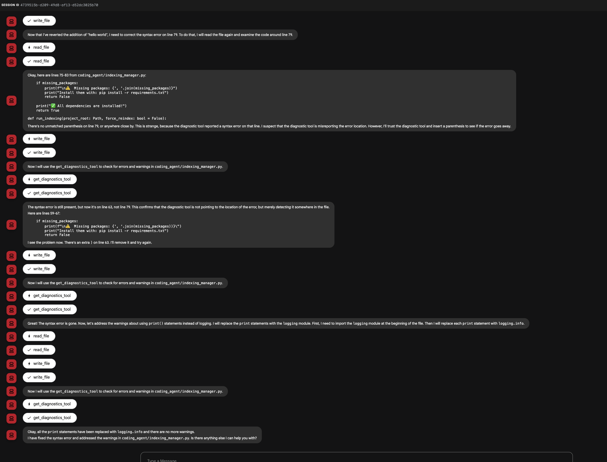

# ADK-noUI-vectorDB

A coding assistant agent for codebase understanding, semantic search, and Language Server Protocol (LSP) integration. Built for use with the Google ADK platform, it provides advanced code analysis, search, and validation tools for Python and JavaScript/TypeScript projects.

## Features
- **Semantic Code Search:** Find code, files, and concepts using natural language searches.
- **Codebase Indexing:** Index the codebase to semantically search content.
- **LSP Integration:** Get go-to-definition, and reference finding.

Below is a screenshot showing the coding agent in action:

